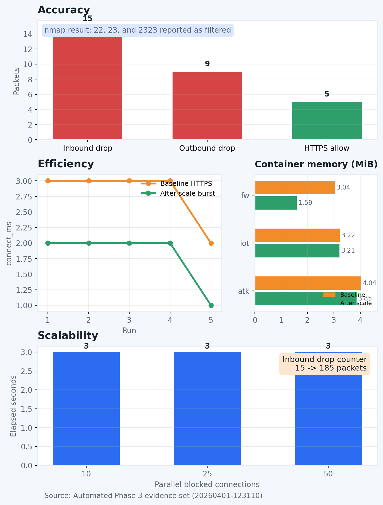

# IoT Secure Gateway: Mirai Mitigation Lab

A network security project that simulates Mirai-style IoT attack behavior and validates a firewall-based defense using Docker, Linux networking, `nftables`, Bash, and PowerShell automation.

This repository showcases hands-on skills in threat modeling, network segmentation, containerized security architecture, firewall engineering, attack simulation, automation, and technical reporting.



## Project Summary

The goal of this project is to protect a simulated IoT device from botnet-style exposure by placing it behind a dedicated gateway that enforces a default-deny forwarding policy.

The design is based on the Mirai botnet case study and focuses on the same practical weaknesses that made Mirai effective:

- exposed SSH and Telnet-style services
- poor segmentation between trusted and untrusted network zones
- unrestricted outbound communication from compromised devices

To address those weaknesses, the project implements a three-node lab:

- `fw`: firewall and gateway container
- `iot`: protected IoT device container
- `atk`: external WAN attacker and controlled service endpoint

The firewall allows only explicitly approved traffic, blocks inbound management access from the WAN, blocks risky outbound SSH and Telnet-style traffic from the IoT segment, and preserves legitimate outbound HTTPS connectivity.

## Recruiter Highlights

- Designed and implemented a containerized security lab that mirrors a realistic gateway-based IoT defense model
- Built a default-deny `nftables` policy for network segmentation and packet filtering
- Automated testing and evidence capture with PowerShell and Bash
- Simulated Mirai-style reconnaissance and connection attempts with `nmap` and `netcat`
- Collected measurable security and performance evidence including rule counters, connection timing, and scalability behavior
- Produced formal project documentation in LaTeX and Markdown

## Technologies Used

- Docker
- Docker Compose
- Linux networking
- `nftables`
- Bash
- PowerShell
- `nmap`
- `netcat`
- Vagrant
- VirtualBox
- Markdown
- LaTeX

## Skills Demonstrated

### Security Engineering

- threat modeling from a real botnet case study
- network segmentation design
- firewall policy design with default-deny enforcement
- inbound and outbound traffic control
- security validation using packet-filter counters

### Systems and Infrastructure

- multi-container environment design with static addressing
- Linux routing and forwarding configuration
- gateway placement between isolated network segments
- reproducible lab setup with Docker Compose
- earlier virtualized implementation using Vagrant and VirtualBox

### Automation and Testing

- PowerShell-based experiment orchestration
- Bash-based firewall initialization and environment bootstrapping
- repeatable evidence collection
- attack simulation and negative testing
- simple performance and scalability benchmarking

### Communication and Documentation

- technical report writing in LaTeX
- architecture explanation and experiment documentation
- translating cybersecurity research into an implementable prototype

## Architecture

```text
attacker (192.168.56.10)
        |
        |  WAN: 192.168.56.0/24
        v
firewall / gateway
fw: 192.168.56.2 and 10.20.0.1
        |
        |  IoT LAN: 10.20.0.0/24
        v
iot device (10.20.0.10)
```

Core policy behavior:

- block WAN to IoT traffic on ports `22`, `23`, and `2323`
- block other unsolicited WAN to IoT forwarding
- block IoT to WAN traffic on ports `22`, `23`, and `2323`
- allow IoT to WAN traffic on port `443`
- allow return traffic for established flows

## Measurable Results

The automated Phase 3 evaluation produced clear, reproducible results:

- inbound scan results showed ports `22`, `23`, and `2323` as `filtered`
- firewall counters confirmed blocked inbound management traffic and blocked outbound propagation attempts
- legitimate outbound HTTPS remained successful with low measured connection times in the `1-3 ms` range
- burst tests at `10`, `25`, and `50` parallel blocked connection attempts completed while preserving the allowed HTTPS path
- the inbound drop counter increased from `15` to `185` packets after the scalability tests, showing sustained enforcement under heavier traffic

## Why This Project Matters

This project is more than a classroom lab. It demonstrates the ability to take a real cybersecurity problem, study the threat model behind it, and translate that analysis into a working defensive system with measurable results.

From a portfolio perspective, this repository highlights the ability to:

- connect research and implementation
- build practical security controls rather than only describe them
- automate testing and evidence collection
- reason about architecture, tradeoffs, and scalability
- communicate technical work clearly

## Repository Structure

```text
.
|-- docker-lab/
|   |-- atk/
|   |-- fw/
|   |-- iot/
|   |-- docker-compose.yml
|   |-- run-phase3.ps1
|   |-- demo-phase3.ps1
|   |-- PHASE3.md
|-- img/
|   |-- phase3-results-summary.png
|-- scripts/
|   |-- generate_report_figures.py
|-- IoT_Secure_Gateway_Docker_Phase2_Phase3_Report.tex
|-- phase2-report-latex.tex
|-- Vagrantfile
```

## How to Run

### Docker Lab

```bash
cd docker-lab
docker compose up --build -d
docker compose ps
```

### Automated Phase 3 Evaluation

```powershell
cd docker-lab
powershell -ExecutionPolicy Bypass -File .\run-phase3.ps1
```

The automated run writes timestamped evidence into `docker-lab/results/<timestamp>/`.

## Key Files

- [`docker-lab/docker-compose.yml`](docker-lab/docker-compose.yml): container topology and network definitions
- [`docker-lab/fw/entrypoint.sh`](docker-lab/fw/entrypoint.sh): firewall initialization and `nftables` policy generation
- [`docker-lab/run-phase3.ps1`](docker-lab/run-phase3.ps1): automated evidence-driven test workflow
- [`docker-lab/PHASE3.md`](docker-lab/PHASE3.md): manual and presentation-oriented evaluation steps
- [`IoT_Secure_Gateway_Docker_Phase2_Phase3_Report.tex`](IoT_Secure_Gateway_Docker_Phase2_Phase3_Report.tex): full technical report

## Portfolio Positioning

This project is a strong portfolio example for roles related to:

- cybersecurity
- network security
- systems engineering
- DevSecOps
- security operations engineering
- infrastructure automation

It shows practical experience with secure network design, firewall implementation, validation under attack scenarios, and technical communication of results.
